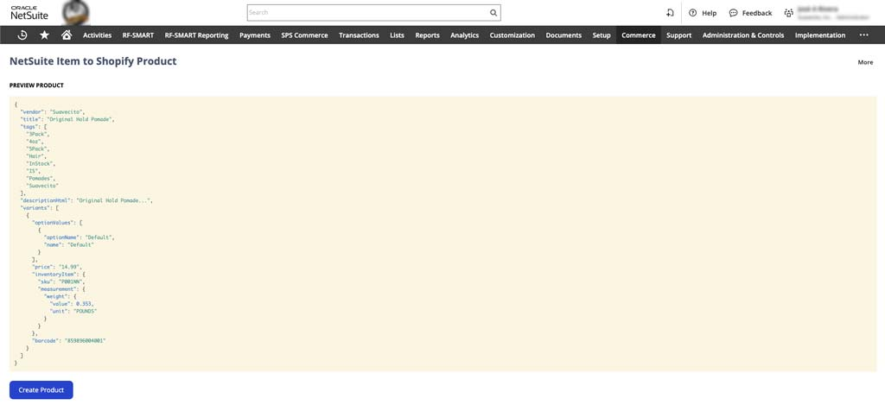

# NetSuite Item to Shopify Product

> A NetSuite SuiteLet to create Shopify product from a NetSuite item record.

This SuiteLet depends on this [AWS Lambda](https://github.com/SuavecitoInc/netsuite-to-shopify-product-lambda) to proxy requests to Shopify.

<div align="center">
	
</div>

<div align="center">
	
</div>

## Setup

The Store option list is set with the config at `/app/src/config/shopify.ts`

```typescript
import stores from './stores';

type ShopifyConfig = {
  stores: {
    [key: string]: {
      text: string;
      value: string;
    };
  };
};

const shopifyConfig: ShopifyConfig = {
	// ---- example
	// stores: {
	//   RETAIL: {
	// 		text: 'RETAIL',
	// 		value: 'retail',
	// 	},
	// 	WHOLESALE: {
	// 		text: 'WHOLESALE',
	// 		value: 'wholesale',
	// 	},
	// }
	stores, // stores imported from ./stores
};

export default shopifyConfig;

```